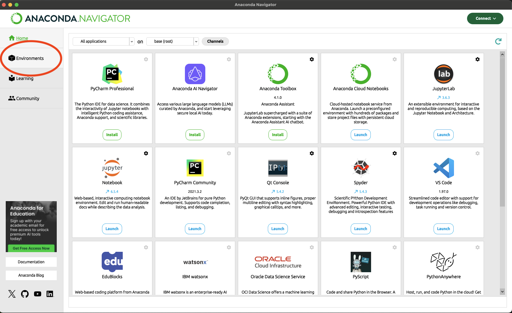
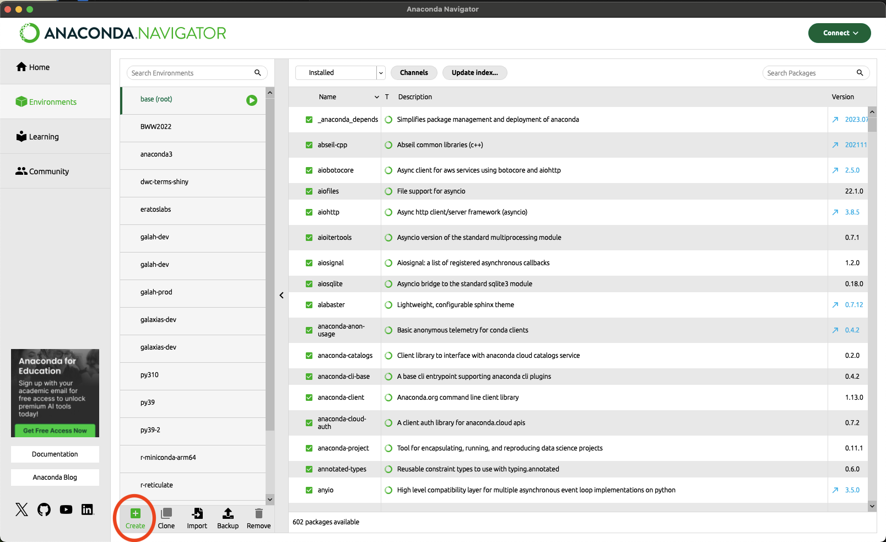
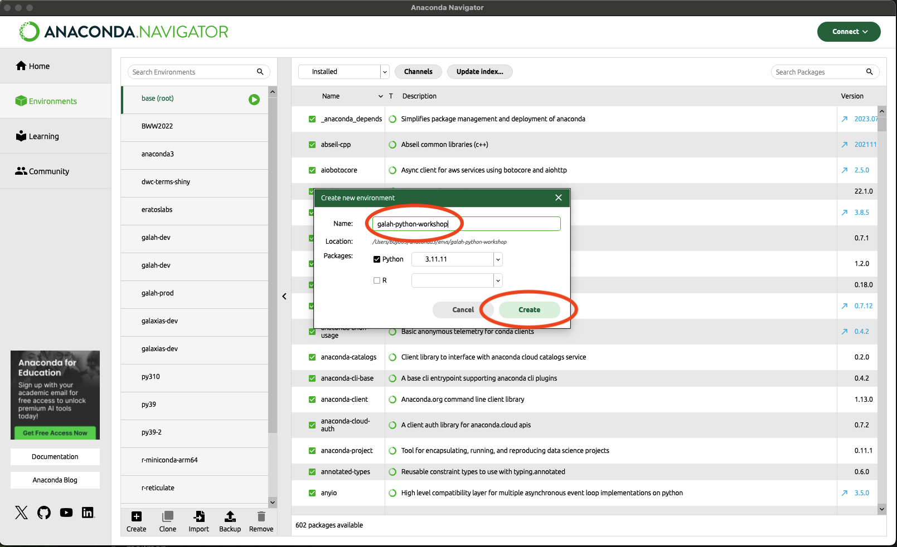
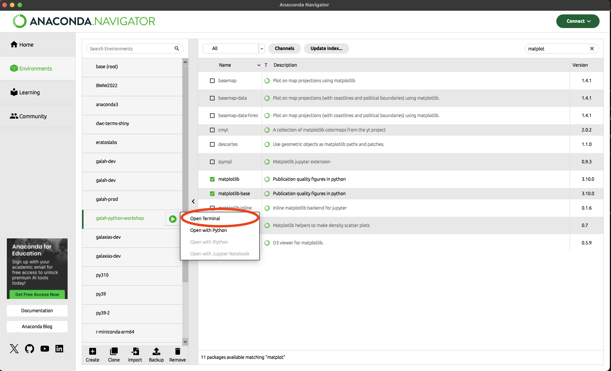
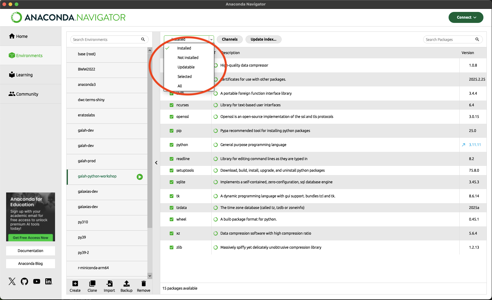
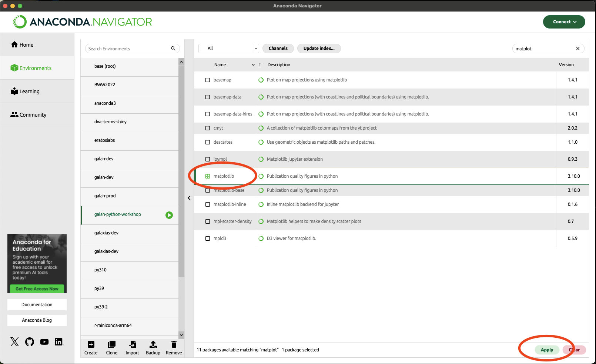
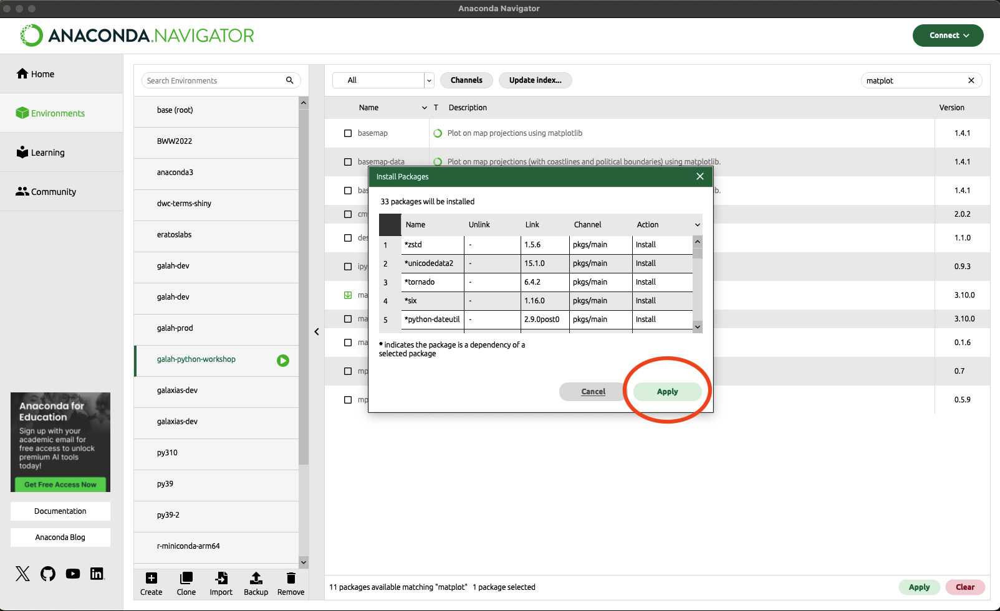

# Installing anaconda

Go to this website:

https://www.anaconda.com/download/success

and download the appropriate distribution for your OS (Mac, Windows, Linux etc.)

# Setting up your environment

## using anaconda-navigator

First, open the navigator and go to `Environments`.



In `Environments`, go to the `Create` button.



Name your environment what makes sense to you.  I used `galah-python-workshop` in this example.



Click `Ok`, and then click on the environment. 

## using the terminal

When you open your terminal, create an environment using the following command (I've used `galah-python-workshop` as the name of the environment; however, feel free to name the environment whatever makes sense to you):

```bash
conda create -n galah-python-workshop python
```

To acivate your conda environment, run

```bash
conda activate galah-python-workshop
```

# Installing `galah-python` and other packages

Unfortunately, I haven't gotten around to shipping `galah-python` to the `conda-forge` installer yet.  However, you can install other packages via `conda-forge` if you would like.

## using Python Package Index (PIP)

First, you need to open a terminal.  If this is your first time working with a terminal, awesome!  You can do it from the anaconda navigator:



when the terminal is opened, type the following into the terminal:

```bash
pip install galah-python geopandas matplotlib jupyter
```

For those who are used to working with a terminal, ensure that you install these in your chosen `conda` environment

## using anaconda-navigator

This example is for `matplotlib`; however, it can be done for all packages except for `galah-python`.

First, under your chosen environment, change the packages from `Installed` to `All`.



In the search button, search for `matplotlib`.  You will get something like this:



Select `matplotlib` and then click `Apply` in the lower left-hand corner.  A pop-up window will come up looking like this:



Click `Apply`, and `matplotlib` will be installed, along with all its dependencies. 