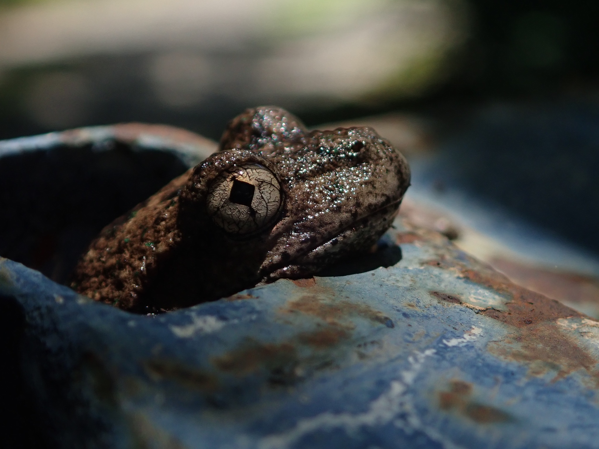

#### *Note*: your number of records may be higher than the numbers listed for the rest of the lesson if you're using this later than September 2023.  As long as it is greater than or equal to the above number, the query worked.

# What does Peron's Tree Frog look like?


Indiaianson CC BY NC



Jeannie CC BY NC

# Step one: looking up Peron's Tree Frog
#### <u>Download record counts of Peron's tree frog</u> since 2018 in New South Wales by FrogID

As the first part of building this query, we need to look up the scientific name of Peron's tree frog.  A quick Google search reveals that the scientific name is *Litoria peronii*.

### Check correct scientific name

To check that *Litoria peronii* is the scientific name for Peron's tree frog in the ALA, run the query

```python 
galah.search_taxa("litoria peronii")
```
```output
    scientificName scientificNameAuthorship  ...          species     vernacularName   issues
0  Litoria peronii          (Tschudi, 1838)  ...  Litoria peronii  Peron's Tree Frog  noIssue
```

From the output above, you can see that the vernacular name, or the common name of *Litoria peronii*, is "Peron's Tree Frog", so we have confirmed this is the species name we are looking for in the Atlas.

If you misspell your query, or search for something that is not in our database, you will get an empty dataframe.

```python
galah.search_taxa("incorrect taxa")
```
```output
Empty DataFrame
Columns: []
Index: []
```

If you want to search for multiple taxa at once, it is possible to do so.  Here, we will enter the scientific name of Peron's Tree Frog, as well as the Common Froglet (*Crinia signifera*) and the Cane Toad (*Rhinella marina*).

```python
galah.search_taxa(taxa=["litoria peronii","Crinia signifera", "Rhinella marina"])
```
```output
     scientificName scientificNameAuthorship     rank  ...     genus           species     vernacularName   issues
0   Litoria peronii          (Tschudi, 1838)  species  ...   Litoria   Litoria peronii  Peron's Tree Frog  noIssue
1  Crinia signifera             Girard, 1853  species  ...    Crinia  Crinia signifera     Common Froglet  noIssue
2   Rhinella marina         (Linnaeus, 1758)  species  ...  Rhinella   Rhinella marina          Cane Toad  noIssue
```

Now, we can get the raw record counts of Peron's Tree Frog:

```python
galah.atlas_counts(
    taxa="litoria peronii"
)
```
```output
   totalRecords
0         95886
```

### Filter our data by year

#### <u>Download record counts of Peron's Tree Frog since 2018</u> in New South Wales by FrogID

Now, we want to get records from 2018 to now.  To figure out what fields we can narrow our query by, we will use the `show_all()` function.

```python
galah.show_all(
    fields=True
)
```
```output
                    id                                     description   type link
0        _nest_parent_                                             NaN  field  NaN
1          _nest_path_                                             NaN  field  NaN
2               _root_                                             NaN  field  NaN
3       abcdTypeStatus                   ABCD field in use by herbaria  field  NaN
4    acceptedNameUsage  http://rs.tdwg.org/dwc/terms/acceptedNameUsage  field  NaN
..                 ...                                             ...    ...  ...
749  multimediaLicence                              Media filter field  media     
750             images                              Media filter field  media     
751             videos                              Media filter field  media     
752             sounds                              Media filter field  media     
753                qid                Reference to pre-generated query  other    
```

Since there are over 700 possible fields to narrow our search by, we know that part of the field would be "year".  Thus, we can use the `search_values()` function to search for values that contain the word "year".

```python
galah.search_all(
    fields="year",column_name="id"
)
```
```output
                    id                                        description   type                                               link
0                 year  The year in which an occurrence was observed. ...  field  https://github.com/AtlasOfLivingAustralia/ala-...
1             raw_year                                                NaN  field                                                NaN
2         endDayOfYear          http://rs.tdwg.org/dwc/terms/endDayOfYear  field                                                NaN
3       occurrenceYear  Year ranges for a search. Calculated based on ...  field                                                NaN
4       startDayOfYear        http://rs.tdwg.org/dwc/terms/startDayOfYear  field                                                NaN
5     raw_endDayOfYear                                                NaN  field                                                NaN
6   raw_startDayOfYear                                                NaN  field                                                NaN
7  namePublishedInYear   http://rs.tdwg.org/dwc/terms/namePublishedInYear  field                                                NaN
```

As we can see by the description of the "year" field, this specifies the year in which an occurrence was observed, which is what we want.  Now, we add the filter to the above query:

```python
galah.atlas_counts(
    taxa="litoria peronii",
    filters="year>=2018"
)
```
```output
   totalRecords
0         69468
```

As this is less than the 95844 records that were shown above, we can see we have already filtered the data.

### Adding other filters: Australian States

#### <u>Download record counts of Peron's Tree Frog since 2018 in New South Wales</u> by FrogID

Now, we will practice adding other possible filters for our query.  First, we will add the specification that we want the counts only in the state of New South Wales.

```python
galah.search_all(
    fields="Australian States"
)
```
```output
       id                                        description    type link
0    cl22  Australian States and Territories Australian S...  layers     
1  cl2013  ASGS Australian States and Territories Austral...  layers  
```

The filter name that we will use is `cl22`.  `cl22` is named as follows:

- `cl` = Contextual Layer (something that's meant to put occurrences into context)
- `22` = it was the 22nd layer to be added to the ALA's spatial data layers

`year` above was relatively self-explanatory, in that the filter was looking for four digits representing a year.  However, what value we should set `cl22` as is not obvious.  To learn what values are possible for the field `cl22`, we will use the the `show_values()` function of `galah-python` as follows:

```python
galah.show_values(
    field="cl22"
)
```
```output
   field                      category
0   cl22               New South Wales
1   cl22                      Victoria
2   cl22                    Queensland
3   cl22               South Australia
4   cl22             Western Australia
5   cl22            Northern Territory
6   cl22                      Tasmania
7   cl22  Australian Capital Territory
8   cl22                      Unknown1
9   cl22             Coral Sea Islands
10  cl22   Ashmore and Cartier Islands
```

Here, we get all possible values for `cl22`, and can see that `New South Wales` is the string that we need to set as `cl22`'s value.  

Now, we can apply that filter to the query as follows:

```python
galah.atlas_counts(
    taxa="litoria peronii",
    filters=["year>=2018",
             "cl22=New South Wales"]
)
```
```output
   totalRecords
0         61984
```

### Adding other filters: Data Resources 

#### <u>Download record counts of Peron's Tree Frog since 2018 in New South Wales by FrogID</u>

To get the last part of the query, will be searching for a specific data provider.  In the ALA, they are known as "data resources".  To search for the list of data resources, or data providers, we will use the phrase "dataResource" to search for values.

```python
galah.search_all(
    fields="data",
    column_name="id"
)
```
```output
                         id                                        description   type link
0                 inDataset                                                NaN  field  NaN
1                 datasetID             http://rs.tdwg.org/dwc/terms/datasetID  field  NaN
2                dataHubUid         The Atlas thematic groups for this record.  field  NaN
3               datasetName  The name of the dataset for this record. Typic...  field  NaN
4               dataHubName                                                NaN  field  NaN
5           dataProviderUid                 The Atlas ID for the data resource  field  NaN
6           dataResourceUid  A list (concatenated and separated) of prepara...  field  NaN
7          raw_datasetTitle                                                NaN  field  NaN
8          text_datasetName                                                NaN  field  NaN
9          dataProviderName                  The data provider for this record  field  NaN
10         dataResourceName  The data resource that supplies the record. Th...  field  NaN
11      raw_dataProviderUid                                                NaN  field  NaN
12      raw_dataResourceUid                                                NaN  field  NaN
13      dataGeneralizations   http://rs.tdwg.org/dwc/terms/dataGeneralizations  field  NaN
14     raw_dataProviderName                                                NaN  field  NaN
15     raw_dataResourceName                                                NaN  field  NaN
16  raw_dataGeneralizations                                                NaN  field  NaN
```

For our query, we will be choosing `dataResourceName`.  This is because FrogID is a data resource for the ALA, and searching under `dataResourceName` rather than `dataResourceUid` will yield better results in this case.

to show values, type

```python
galah.show_values(
    field="dataResourceName"
)
```
```output
                 field                                           category
0     dataResourceName                                    eBird Australia
1     dataResourceName                                   NSW BioNet Atlas
2     dataResourceName                        BirdLife Australia, Birdata
3     dataResourceName                       Victorian Biodiversity Atlas
4     dataResourceName                              iNaturalist Australia
...                ...                                                ...
1090  dataResourceName                                    Scotland Island
1091  dataResourceName  The second confirmed record and a significant ...
1092  dataResourceName                Tidbinbilla Nature Recording System
1093  dataResourceName                          Tweed Council Koala Count
1094  dataResourceName                         Warrumbungle Koala Project
```

Unlike for Australian States, in which there are 10 possible values, there are over 1000 data resources the ALA gets its data from.  To search for the FrogID value in these data resources, we can use the function `search_values()` to search for the specific value we need.

```python
galah.search_values(
    field="dataResourceName",
    value="frogid"
)
```
```output
              field category
0  dataResourceName   FrogID
```

Now, we can add the final filter to our query.

```python
galah.atlas_counts(
    taxa="litoria peronii",
    filters=["year>=2018",
             "cl22=New South Wales",
             "dataResourceName=FrogID"]
)
```
```output
   totalRecords
0         27969
```