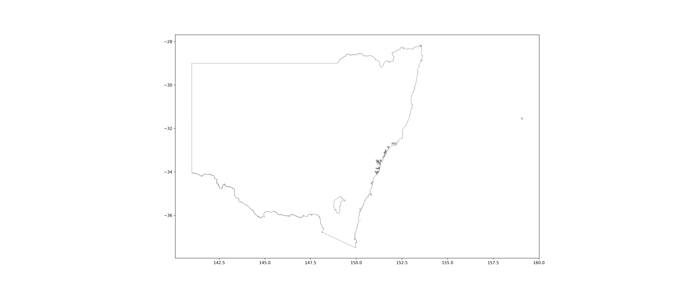
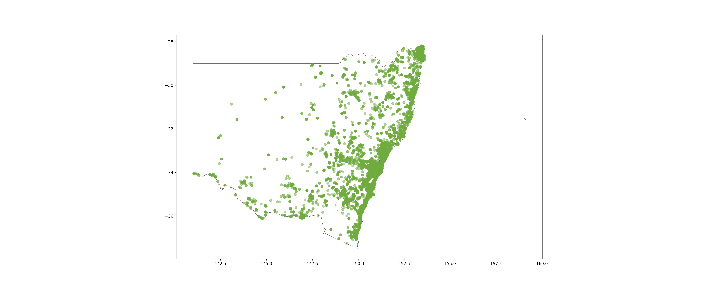

# Download occurrence records 

Remember the query we built from Episode 2:

#### <u>Download record counts of Peron's tree frog since 2018 in New South Wales by FrogID</u>

```python
galah.atlas_counts(
    taxa="litoria peronii",
    filters=["year>=2018",
             "cl22=New South Wales",
             "dataResourceName=FrogID"]
)
```
```output
   totalRecords
0         27969
```

All we have to do to download occurrences is to change the function name `atlas_counts` to `atlas_occurrences`, but first, we need to provide an email registered with the ALA to `galah-python`:

```python
galah.galah_config(email="amanda.buyan@csiro.au")
galah.atlas_occurrences(
    taxa="litoria peronii",
    filters=["year>=2018",
             "cl22=New South Wales",
             "dataResourceName=FrogID"]
)
```
```output
                                   recordID  catalogNumber  ... dataGeneralizations spatiallyValid
0      0008c41d-fd35-421a-9976-8213ade88ba8            NaN  ...                 NaN           True
1      000c1c20-bec3-4fc3-8d65-3de76961a998            NaN  ...                 NaN           True
2      000e46ad-9ace-437c-ac31-48843f603c9c            NaN  ...                 NaN           True
3      001229c0-4c48-486f-8d5d-5ddfe7420756            NaN  ...                 NaN           True
4      0014b8ff-ddd5-4a24-b7ee-cb57c62ba2d2            NaN  ...                 NaN           True
...                                     ...            ...  ...                 ...            ...
27964  fff85846-94f6-4285-b520-219a574beaa6            NaN  ...                 NaN           True
27965  fffa5afb-2388-4ec2-937c-d73c104352d3            NaN  ...                 NaN           True
27966  fffb30c7-cee4-4d5d-8c36-b15721ac4565            NaN  ...                 NaN           True
27967  fffba153-a597-4ed2-a325-8f9d3e567ae9            NaN  ...                 NaN           True
27968  fffd964f-475f-4a9d-9763-5654fa842aee            NaN  ...                 NaN           True
```

All of this data for each occurrence record is great!  However, say you want to only get specific columns of the table, like `decimalLatitude`,`decimalLongitude` and `scientificName`.  You can specify column names in the `fields` argument of `atlas_occurrences`:

```python
galah.galah_config(email="amanda.buyan@csiro.au")
galah.atlas_occurrences(
    taxa="litoria peronii",
    filters=["year>=2018",
             "cl22=New South Wales",
             "dataResourceName=FrogID"],
    fields=["scientificName","decimalLatitude","decimalLongitude"]
)
```
```output
        scientificName  decimalLatitude  decimalLongitude
0      Litoria peronii       -32.303061        151.687980
1      Litoria peronii       -32.809788        151.353210
2      Litoria peronii       -29.929163        152.008692
3      Litoria peronii       -36.354229        150.075424
4      Litoria peronii       -34.496047        150.777103
...                ...              ...               ...
27964  Litoria peronii       -30.101165        153.161719
27965  Litoria peronii       -34.053162        151.086362
27966  Litoria peronii       -33.614032        150.697754
27967  Litoria peronii       -34.643233        150.325404
27968  Litoria peronii       -34.314148        150.918278
```

# Make a map of *Litoria peronii* occurrence records since 2018 in New South Wales

Now, we will make a map showing where all the occurrence records we downloaded are in New South Wales.  This is where the packages `matplotlib` and `geopandas` you installed at the beginning of the lesson will be used.  The shape file you will need for this exercise can be found [here](https://www.abs.gov.au/statistics/standards/australian-statistical-geography-standard-asgs-edition-3/jul2021-jun2026/access-and-downloads/digital-boundary-files/STE_2021_AUST_SHP_GDA94.zip).

```python
import galah
from matplotlib import pyplot as plt
import geopandas as gpd

# Get Peron's tree frog occurrences
frogs = galah.atlas_occurrences(
  taxa="litoria peronii",
  filters=["year>=2018",
           "cl22=New South Wales",
           "dataResourceName=FrogID"],
  fields=["scientificName","decimalLongitude","decimalLatitude"]
)

# Get Australian state and territory boundaries  
states = gpd.read_file("STE_2021_AUST_GDA94.shp")

# Change Coordinate Reference System (CRS) of the shape file and plot New South Wales 
states = states.to_crs(4326)
states[states["STE_NAME21"] == "New South Wales"].plot(edgecolor = "#5A5A5A", linewidth = 0.5, facecolor = "white", figsize = (24,10))
```



```python
# Add occurrence records to the map
ax = states[states["STE_NAME21"] == "New South Wales"].plot(edgecolor = "#5A5A5A", linewidth = 0.5, facecolor = "white", figsize = (24,10))
plt.scatter(frogs['decimalLongitude'],frogs['decimalLatitude'], c = "#6fab3f", alpha = 0.5)
```

