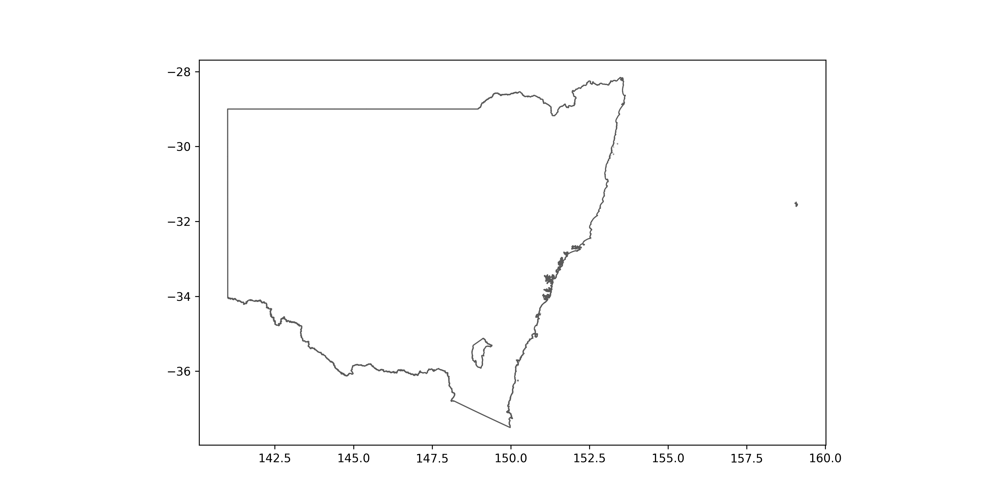
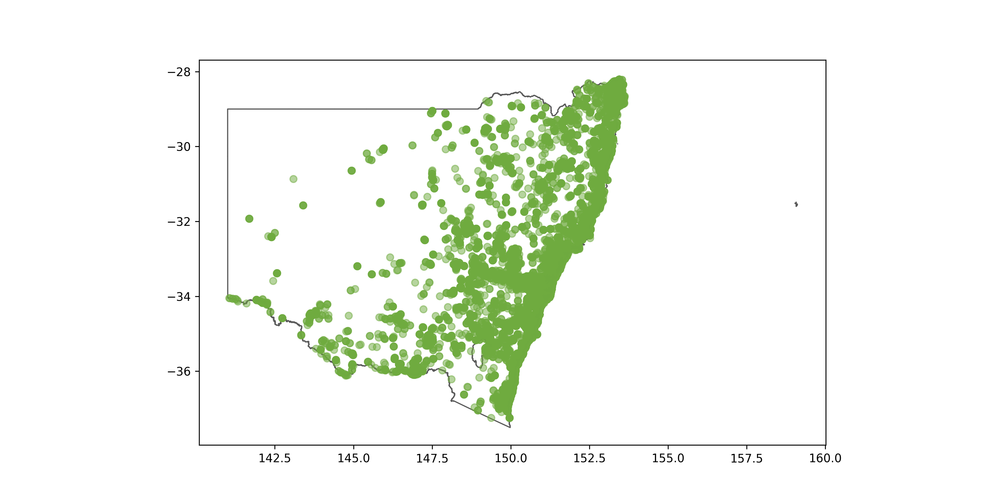
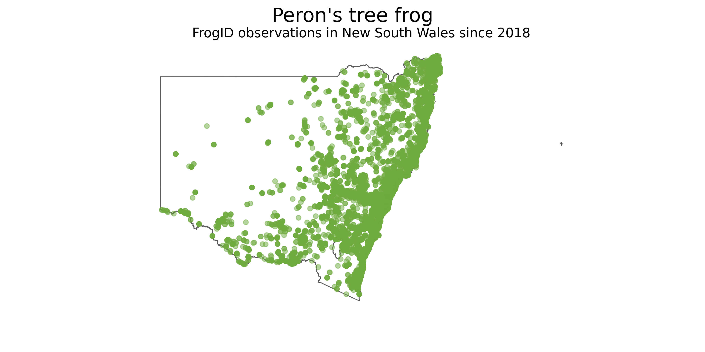

# Download occurrence records 

Remember the query we built from Episode 2:

#### <u>Download record counts of Peron's tree frog since 2018 in New South Wales by FrogID</u>

```python
galah.atlas_counts(
    taxa="litoria peronii",
    filters=["year>=2018",
             "cl22=New South Wales",
             "dataResourceName=FrogID"]
)
```
```output
   totalRecords
0         39840
```

All we have to do to download occurrences is to change the function name `atlas_counts` to `atlas_occurrences`, but first, we need to provide an email registered with the ALA to `galah-python`:

```python
galah.galah_config(email="amanda.buyan@csiro.au")
galah.atlas_occurrences(
    taxa="litoria peronii",
    filters=["year>=2018",
             "cl22=New South Wales",
             "dataResourceName=FrogID"]
)
```
```output
       decimalLatitude  decimalLongitude             eventDate  ...                              recordID dataResourceName occurrenceStatus
0           -37.246800        149.375000  2020-12-27T00:00:00Z  ...  56de6c10-b14d-4eeb-86ee-a50e406678d3           FrogID          PRESENT
1           -37.245410        149.957044  2022-10-26T00:00:00Z  ...  685271bf-5bbf-4174-b8e2-c92c4b5ee586           FrogID          PRESENT
2           -37.245385        149.957663  2021-12-11T00:00:00Z  ...  4155af9f-38bf-4093-976f-65d17029d1c4           FrogID          PRESENT
3           -37.245385        149.957663  2021-12-11T00:00:00Z  ...  aee93398-6e27-4134-a1c3-9a4c794d1ce6           FrogID          PRESENT
4           -37.245385        149.957663  2021-12-11T00:00:00Z  ...  360887c3-4af9-4430-801e-8b7db47a2389           FrogID          PRESENT
...                ...               ...                   ...  ...                                   ...              ...              ...
39835       -28.207514        153.442592  2018-11-15T00:00:00Z  ...  10ec5c96-fb1e-4545-9e85-dc9073e3a977           FrogID          PRESENT
39836       -28.207494        153.442526  2021-11-17T00:00:00Z  ...  302250c5-6b7b-4d5d-b51b-12fa305ae8c9           FrogID          PRESENT
39837       -28.207472        153.442497  2018-11-15T00:00:00Z  ...  101f5f04-b0e9-45b4-a9c0-3e50d97f1dfe           FrogID          PRESENT
39838       -28.207442        153.442328  2020-02-07T00:00:00Z  ...  f827c2ef-fcf4-40cc-ab3d-fc1f4ec8c61b           FrogID          PRESENT
39839       -28.207108        153.443021  2021-02-19T00:00:00Z  ...  f02823d8-f53a-4cde-b546-d3bd7ff7b075           FrogID          PRESENT
```

All of this data for each occurrence record is great!  However, say you want to only get specific columns of the table, like `decimalLatitude`,`decimalLongitude` and `scientificName`.  You can specify column names in the `fields` argument of `atlas_occurrences`:

```python
galah.galah_config(email="amanda.buyan@csiro.au")
galah.atlas_occurrences(
    taxa="litoria peronii",
    filters=["year>=2018",
             "cl22=New South Wales",
             "dataResourceName=FrogID"],
    fields=["scientificName","decimalLatitude","decimalLongitude"]
)
```
```output
        scientificName  decimalLatitude  decimalLongitude
0      Litoria peronii       -33.624100        151.323000
1      Litoria peronii       -33.718800        151.003000
2      Litoria peronii       -33.324700        151.365000
3      Litoria peronii       -33.572700        148.436000
4      Litoria peronii       -35.115900        147.981000
...                ...              ...               ...
39835  Litoria peronii       -33.817474        151.177367
39836  Litoria peronii       -33.948932        151.251668
39837  Litoria peronii       -33.930552        151.237679
39838  Litoria peronii       -33.686587        151.096895
39839  Litoria peronii       -33.448529        151.375129
```

# Make a map of *Litoria peronii* occurrence records since 2018 in New South Wales

Now, we will make a map showing where all the occurrence records we downloaded are in New South Wales.  This is where the packages `matplotlib` and `geopandas` you installed at the beginning of the lesson will be used.  The shape file you will need for this exercise can be found [here](https://www.abs.gov.au/statistics/standards/australian-statistical-geography-standard-asgs-edition-3/jul2021-jun2026/access-and-downloads/digital-boundary-files/STE_2021_AUST_SHP_GDA94.zip).

```python
import galah
from matplotlib import pyplot as plt
import geopandas as gpd

# Get Peron's tree frog occurrences
frogs = galah.atlas_occurrences(
  taxa="litoria peronii",
  filters=["year>=2018",
           "cl22=New South Wales",
           "dataResourceName=FrogID"],
  fields=["scientificName","decimalLongitude","decimalLatitude"]
)

# Get Australian state and territory boundaries  
states = gpd.read_file("STE_2021_AUST_GDA94.shp")

# Change Coordinate Reference System (CRS) of the shape file and plot New South Wales 
states = states.to_crs(4326)
states[states["STE_NAME21"] == "New South Wales"].plot(edgecolor = "#5A5A5A", linewidth = 1.0, facecolor = "white", figsize = (24,10))
```



```python
# Add occurrence records to the map
ax = states[states["STE_NAME21"] == "New South Wales"].plot(edgecolor = "#5A5A5A", linewidth = 1.0, facecolor = "white", figsize = (24,10))
plt.scatter(frogs['decimalLongitude'],frogs['decimalLatitude'], c = "#6fab3f", alpha = 0.5)
```



```python
# Add final touches to figure
plt.suptitle("Peron's tree frog",fontsize=24)
plt.title("FrogID observations in New South Wales since 2018",fontsize=16)
plt.axis('off')
```

